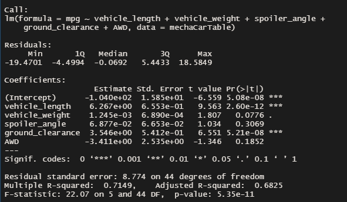

# MechaCar_Statistical_Analysis
 R Code

 **R File:** [Mecha Car Challenge](MechaCarChallenge.Rscript.R)

## Linear Regression to Predict MPG

The variables/coefficients that provided a non random amount of variance to the dataset is the vehicle_length, vehicle_weight and the ground_clearance all with p values less than 0.05

The Slope of the linear model would not be considered to be zero because one of the main contributing variables has a slope of approximatley 6.267 thus implying a positve slope

This linear model effectivley predicts mpg of mecha car prototypes becuase the multiple rquared value is 0.7149 meaning approximatley 71.5% of the variability can be explained by this model.

## Summary Statistics on Suspension Coils

In total the variance is approximatley 62.3 pounds per square inch satisfying this requirement of being under 100 pounds per square inch.

For each individual lot the variance for lot 1 is approximatley 0.98, for lot 2 it is approximatley 7.47 and for lot 3 it is approximatley 170.29. The first 2 lots meet this requirement while lot 3 does not. The reason lot 3 variance is very high is because there are many PSI values that are 10-50 PSI from 1500.

## T-Tests on Suspension Coils

- In the lot1 t-test the p value is 1 thus the null hypothesis cannot be rejected so the true mean is equal to 1500 

- The lot2 t-test has a p-value of 0.6072 thus the null hypothesis cannot be rejected aswell

- The lot3 t-test has a p-value of 0.04168 thus the null hypothesis is rejected because the p-value is less than 0.05. The alternative hypothesis says that the true mean is not equal to 1500.

## Study Design: MechaCar vs Competition.

In this study we will be looking at how vehicle weight and ground clearance affects our fuel effeciency which is mpg.

- The three metrics that will be tested are the vehicle_weight, ground_clearance and the mpg

- null hypothesis: the vehicle_weight and ground_clearance have no correlation to mpg

- alternative hypothesis: the vehicle_weight and ground_clearance have a correlation to mpg

- The statistical test that would be used is multiple linear regression because there are 2 independent variables and 1 independent variable involved, the data for the variables are countinous and it will answer our question on how much variance is being accounted for. 

- The data that would be needed would come from the MechaCar dataframe that     extracted the data from the mechacar csv. The three variables which is the vehicle_length, vehicle_weight and the mpg which all have datatypes that are of type num. 

